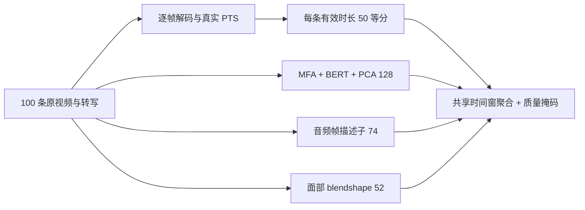
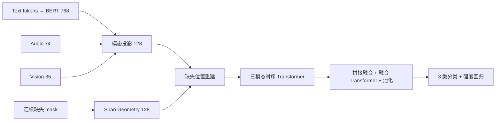
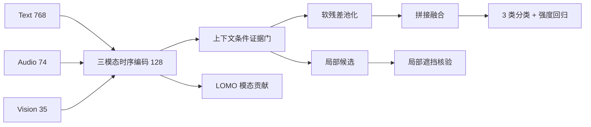

# 最终模型卡与结构

## Q1：50 窗三模态特征与时序对齐

输入：视频、转写；输出：text `[100,50,128]`、audio `[100,50,74]`、vision `[100,50,52]`、`time_edges [100,51]`。参数：`K=50`，其余见 `E题/Q1/feature_config.yaml`。无情感预测头或 checkpoint。Source: `E题/Q1/validation_report.json`、`q1_pipeline.py`。

## Q2：R3 Temporal Reconstruction（局部时序重建）

每模态时序张量 `[B,50,128]`，拼接融合前为 `[B,50,384]`；输出分类 `[B,3]`、回归 `[B]`。最终 `use_position=false`、`fusion_mode=concat`、`use_reliability=false`；重建分支有内部时间向量。Loss（损失）为加权 CE（交叉熵） + `0.5 × SmoothL1` + `0.1 × L_rec`（重建损失）。最终配置：`E题/Q2/configs/best_R3_reconstruction.yaml`。原始大 checkpoint 未入 Git；紧凑基础参数与 R3 增量在 `paper_package/Q2/model_parameters/`，还需公开 BERT 基础权重。Source: `E题/Q2/models/{clean_backbone,srf_msa,temporal_reconstruction}.py`、`missing_train.py`。

## Q3：FER-MSA v2 B1

输入 `[B,50,768/74/35]`，编码后每模态 `[B,50,128]`，融合输入 `[B,384]`，输出 `[B,3]` 和 `[B]`。最终 `use_position=false`、`pooling_mode=legacy`、`router_diagnostic=true`；Router（路由器）不进入预测主路。训练 Loss（损失）：分类 + 回归，配置中解释正则项为 0。最终权重：`E题/Q3/outputs/q3_v2/final_model.pt`，配置：`E题/Q3/configs/q3_v2_final.yaml`。Source: `E题/Q3/models/fer_msa.py`、`modality_encoder.py`、`configs/q3_v2_final.yaml`。

参数量未现成记录；本次不加载大型模型重新计算。
