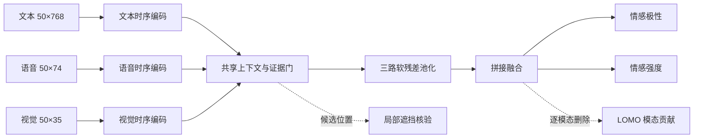
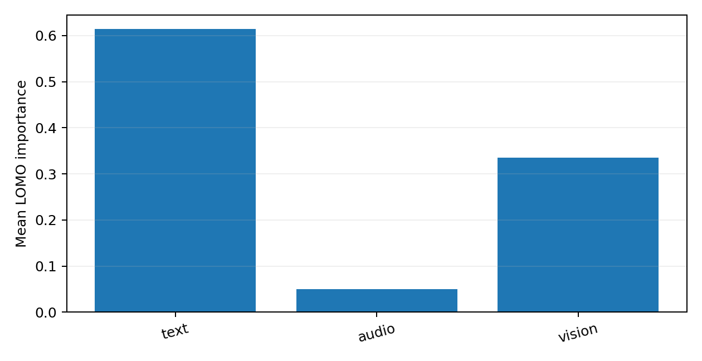
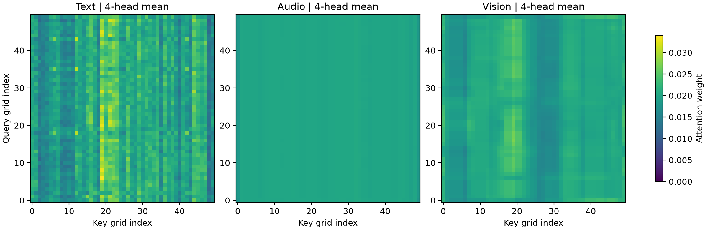
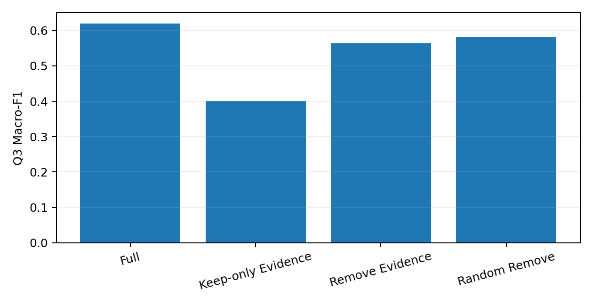
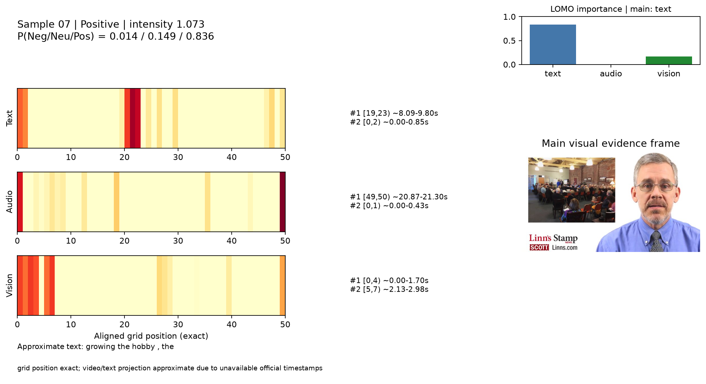

# 第三章 可解释性多模态情感预测模型

## 3.1 问题分析与数据

问题三要求在文本、语音和视觉信息完整的条件下，同时预测情感极性与情感强度，并说明每条预测主要依赖的模态、三模态的作用程度及关键局部证据。解释结果还需能够回到原始文本片段、语音时段或视觉关键帧。因此，仅输出模型内部权重不足以回应题意：本章将预测、模态级反事实分析和局部片段核验连接为一条可复核的解释链。

模型使用附件二给出的官方训练集学习参数、验证集选择结构与证据预算。每个样本有 50 个对齐时间位置，文本、语音、视觉特征的维数分别为 768、74、35；填充位置由有效位置掩码排除。最终模型对附件四的**对齐版本**运行一次冻结推理。附件四包含原始视频，可用于回看解释片段，但没有情感标签，故其输出不用于计算准确率或继续选择模型。附件一在问题一中自行提取的特征与本章附件二的输入接口不同，不能直接替换。

## 3.2 模型建立

### 3.2.1 三模态时序编码与双任务预测

记模态集合为 \(\mathcal M=\{T,A,V\}\)，输入为 \(X^{(m)}\in\mathbb R^{50\times d_m}\)，其中 \((d_T,d_A,d_V)=(768,74,35)\)。每一路先经过层归一化、线性投影、GELU 激活与随机失活，得到 128 维序列，再由两层、每层四个注意力头的 Transformer（时序变换器）分别编码：

\[
H^{(m)}=\operatorname{Encoder}_m\!\left(\operatorname{Adapter}_m(X^{(m)}),M\right)
\in\mathbb R^{50\times128}. \tag{3-1}
\]

这里 \(M\) 是有效位置掩码。三个编码器结构相同但参数独立。最终版本未加入绝对时间位置嵌入；这一模块只在消融实验中比较。

在每个时间位置拼接三路编码结果，经过线性变换和层归一化得到共享上下文 \(c_t\)。上下文条件证据门将 \(c_t\) 与对应模态状态 \(h_t^{(m)}\) 联合输入，产生门值：

\[
c_t=\operatorname{LN}\!\left(W_c[h_t^{(T)};h_t^{(A)};h_t^{(V)}]+b_c\right),\qquad
g_t^{(m)}=M_t\,\sigma\!\left(\frac{f_m([h_t^{(m)};c_t])}{\tau}\right). \tag{3-2}
\]

\(f_m\) 为两层前馈网络，\(\tau\) 为随最终权重保存的门控温度。门值通过软残差池化参与预测：

\[
w_t^{(m)}=M_t\bigl(0.9g_t^{(m)}+0.1\bigr),\qquad
r^{(m)}=\frac{\sum_t w_t^{(m)}h_t^{(m)}}{\sum_t w_t^{(m)}}. \tag{3-3}
\]

式（3-3）保留了低门值位置的少量信息，避免将其直接清零。三个模态向量各按固定系数 \(1/3\) 缩放后拼接，经 \(384\!\to\!256\!\to\!128\) 的融合网络得到整体表示 \(z\)。分类头输出负向、中性、正向的概率 \(p=\operatorname{softmax}(W_{\rm cls}z+b_{\rm cls})\)，回归头输出 \(\hat y=3\tanh(W_{\rm reg}z+b_{\rm reg})\in[-3,3]\)。本章的“主要模态”由后述逐模态删除确定；代码中的 Router（诊断路由器）只作辅助记录，不参与融合向量或预测头的计算。

**图3-1** 最终 FER-MSA v2 B1 的预测与解释结构。实线是预测主路，虚线是预测后的解释计算；图中的 50 表示统一时间网格长度。

### 3.2.2 目标函数与训练方案

分类采用由训练集类别频数确定权重的交叉熵，回归采用 \(\beta=0.5\) 的 Smooth L1（平滑绝对误差）损失。最终 B1 的优化目标为

\[
\mathcal L=\mathcal L_{\rm cls}+\mathcal L_{\rm reg}. \tag{3-4}
\]

最终配置中解释预算、二值化、平滑性、充分性及全面性等附加损失系数均为零，不能把历史版本的这些损失写入最终训练目标。训练使用随机种子 42、批量大小 32、AdamW 优化器、初始学习率 \(2\times10^{-4}\)、随机失活率 0.15，最多 60 轮，早停耐心值为 10。服务器记录的环境为 Python 3.11.16 与 PyTorch 2.12.1+cu130；完整依赖见[复现说明](../../E题/Q3/Q3_V2_REPRODUCE.md)。最终预测权重来自验证集 Macro-F1 最优的 B1 第 4 轮。门控温度随训练配置调整，推理使用权重文件记录的温度。诊断 Router 在预测主干冻结后用训练集逐模态删除目标拟合，不改变分类或回归结果。

### 3.2.3 三层解释与关键证据定位

第一层给出类别概率、预测极性及连续强度。第二层使用 LOMO（Leave-One-Modality-Out，逐模态删除）计算样本级模态贡献：将一个模态的有效位置替换为**仅由训练集计算**的特征均值，其余模态保持不变，再比较完整预测与替换后预测。对模态 \(m\)，记完整预测类别为 \(\hat c\)，定义

\[
u_m=0.6\left|p_{\hat c}(X)-p_{\hat c}(X^{-m})\right|
    +0.4\frac{\left|\hat y(X)-\hat y(X^{-m})\right|}{6},\qquad
I_m=\frac{u_m}{\sum_{j\in\mathcal M}u_j}. \tag{3-5}
\]

\(I_T,I_A,I_V\) 是三模态作用程度，最大者定义为主要参考模态。式（3-5）衡量的是模型预测对特征替换的敏感度，不等同于真实情绪成因。诊断 Router 的权重也不替代 \(I_m\)。

第三层定位局部证据。每个模态先由证据门提出门值最高的至多 12 个候选位置；对每个候选，使用训练集特征均值遮挡其附近 3 格时间窗，重新计算分类概率和回归值的变化。候选分数由模态内归一化的门值和遮挡影响按 0.4 与 0.6 加权；在名义预算 0.25 下选取高分位置，将相邻位置合并为连续片段，并保留每模态得分最高的至多两个片段。片段分数为所含位置平均分与片段长度平方根的乘积。系统同时保存遮挡前后的**带符号**变化，把片段记为支持、反向或混合证据。因此，“高重要性”表示影响幅度大，并不保证该片段支持当前预测。

模型的准确定位单位是 50 格特征网格。附件四视频提供原始画面与语音，可按片段大致回看；但赛题附件未给出词元和特征网格对应的官方时间戳，程序按视频总时长均匀换算秒数、按文本长度比例截取词语并抽取邻近关键帧。这些秒数、词语边界与关键帧是**近似回投**，不能写成逐词或逐帧的真实定位标注。

## 3.3 验证集实验与解释分析

### 3.3.1 预测性能和结构选择

验证集共有 728 条样本。最终 B1 的分类准确率为 0.6332，Macro-F1 为 0.6194；强度预测的 MAE 为 0.6149，Pearson 相关系数为 0.6576。四项指标分别衡量类别正确率、类别均衡表现、绝对强度误差和强度变化相关性。

| 模型 | Accuracy | Macro-F1 | MAE | Pearson |
|---|---:|---:|---:|---:|
| B0：无证据门 | 0.6305 | 0.6163 | 0.6151 | 0.6579 |
| **B1：最终预测主干** | **0.6332** | **0.6194** | **0.6149** | **0.6576** |
| B2：增加绝对时间位置 | 0.6181 | 0.6056 | 0.6259 | 0.6151 |
| B3：增加门控感知池化 | 0.6429 | 0.6213 | 0.6536 | 0.6173 |
| B4：增加门控正则 | 0.6401 | 0.6180 | 0.6533 | 0.6166 |
| B5：B4 加诊断 Router | 0.6401 | 0.6180 | 0.6533 | 0.6166 |

**表3-1** 问题三验证集消融。数据来源：[B0–B5 消融原表](../../E题/Q3/outputs/q3_v2/ablation_v2.csv)；最终 B1 指标另见[验证指标文件](../../E题/Q3/outputs/q3_v2/01_a1_reproduction/valid_metrics.json)。

B0 到 B1 的 Accuracy 与 Macro-F1 分别增加约 0.0027 和 0.0031，幅度较小，不据此宣称证据门显著提高预测性能。B3 的分类略高，但回归 MAE 升至 0.6536，且其仅保留证据实验表现较弱，因而没有作为最终方案。B5 与 B4 的预测相同，说明仅用于诊断的 Router 不构成预测增益。最终保留 B1，是综合分类、回归与解释忠实性后的选择，而非只挑最高单项指标。

### 3.3.2 模态作用与注意力可视化

对 728 条验证样本逐条计算式（3-5），文本成为主要模态的样本为 506 条，视觉为 222 条，语音为 0 条；平均作用程度分别为 0.6140、0.0505、0.3355。该分布表明**在当前验证集及所用替换基线下**，模型最常对文本特征敏感，视觉也在部分样本中占主导。语音未成为最大贡献模态，不等于语音特征在所有样本都无作用。

| 模态 | 主模态样本数 | 主模态比例 | 平均 LOMO 作用程度 |
|---|---:|---:|---:|
| 文本 | 506 | 0.6951 | 0.6140 |
| 语音 | 0 | 0.0000 | 0.0505 |
| 视觉 | 222 | 0.3049 | 0.3355 |

**表3-2** 验证集模态作用差异。数据来源：[逐样本解释](../../E题/Q3/outputs/q3_v2/faithfulness/final_b1_router/budget_025/valid_explanations.csv)，汇总见[自动生成表](../tables/table_q3_modality_importance.md)。

**图3-2** 验证集三模态平均 LOMO 作用程度；该统计不是 Router 权重。

为展示时序编码器内部如何在位置之间交换信息，图3-3给出附件四样本 07 的最后一层四头自注意力矩阵。横轴为被关注的时间网格位置，纵轴为发出查询的时间网格位置；三幅图共用色标。文本支路在若干列形成较集中的响应，语音支路在该样本上接近均匀分布。这是**单一样本的内部计算可视化**，不能据此推出语音整体无贡献，也不能把自注意力数值当作正式的模态作用程度或已核验的证据。四个文本注意力头的细图见[补充图](../figures/q3_attention_07_text_heads.png)。

**图3-3** 样本 07 的四头平均自注意力热图。数据由最终 B1 权重对一个已存在的附件四样本进行单次前向读取；没有重新训练或计算附件四评价指标。[生成脚本](../scripts/export_q3_attention.py)与[文本](../generated/q3_attention_07_text_mean.csv)、[语音](../generated/q3_attention_07_audio_mean.csv)、[视觉](../generated/q3_attention_07_vision_mean.csv)矩阵。

### 3.3.3 局部证据与忠实性检验

验证集上以相同证据预算比较四种输入：完整输入、仅保留选中证据、删除选中证据，以及在同模态中匹配位置数并尽量匹配连续段长度的随机删除。随机对照对每条验证样本重复 10 次。该实验检验的是解释片段对**当前模型预测**的影响，不是人工标注的定位准确率。

| 输入条件 | Accuracy | Macro-F1 | MAE | Pearson | 原预测类别平均置信度下降 |
|---|---:|---:|---:|---:|---:|
| 完整输入 | 0.6332 | 0.6194 | 0.6149 | 0.6576 | — |
| 仅保留证据 | 0.5398 | 0.4012 | 0.6722 | 0.6209 | — |
| 删除选中证据 | 0.5975 | 0.5632 | 0.6178 | 0.6405 | 0.0562 |
| 匹配随机删除 | 0.6161 | 0.5814 | 0.6117 | 0.6579 | 0.0329 |

**表3-3** 最终模型的解释忠实性。数据来源：[最终忠实性 JSON](../../E题/Q3/outputs/q3_v2/faithfulness/final_b1_router/budget_025/valid_faithfulness_v2.json)与[逐样本随机对照](../../E题/Q3/outputs/q3_v2/faithfulness/final_b1_router/budget_025/valid_faithfulness_random_control.csv)。

删除选中证据带来的平均置信度下降为 0.0562，大于随机删除的 0.0329；Macro-F1 的下降分别为 0.0562 和 0.0380。可据此说明选中片段在本验证设定下比匹配随机片段更影响分类输出，但未进行显著性检验。仅保留证据时 Macro-F1 降至 0.4012，说明提取的片段仍未覆盖完整预测所需的全部信息。删除证据后的回归 MAE 只增加约 0.0030，回归解释的方向与预期一致而效应较小。

**图3-4** 完整、仅保留、删除证据与随机删除四种条件的预测指标；详值见表3-3。

### 3.3.4 典型样本解释卡

选取附件四的 07 号样本展示赛题要求的完整解释链。模型给出正向极性，正向概率 0.8364，连续强度 1.0733。LOMO 作用程度为文本 0.8349、语音 0.0006、视觉 0.1644，因此主要参考模态是文本。该模态的首位局部证据位于**精确网格** \([19,23)\)；按视频时长近似回投为 8.09—9.80 秒，对应的近似文本片段为 “growing the hobby , the”。遮挡该片段后，原预测类别概率下降约 0.0314，解释方向记为“支持”。解释卡同时给出三模态局部重要性热图、语音候选时段和从原始视频抽取的视觉关键帧，便于逐项回看。由于附件四没有标签，本例只说明预测和解释记录如何追溯到原始素材，不作为预测正确性的证据。

**图3-5** 附件四 07 号样本的解释卡。色带表示门值与局部遮挡影响组合后的**证据重要性**，不是图3-3的自注意力矩阵。网格索引精确；秒数、词语和关键帧为近似回投。

### 3.3.5 附件四全量推理结果

最终模型对附件四对齐版全部 20 条样本完成推理。表3-4同时汇总情感极性、强度、三模态作用、主模态及得分最高的局部证据。表中的“首位证据”在三模态全部候选片段中按分数选取，因而可能与主模态不同；“反向”表示遮挡该片段后原预测类别概率上升，不应删去或改称支持证据。每条样本在每个模态最多保留两个片段，120 条详细片段记录另附 CSV。

| 编号 | 极性 | 强度 | 文本/语音/视觉贡献 | 主模态 | 首位证据（网格） | 方向 |
|---|---|---:|---|---|---|---|
| 01 | 中性 | 0.206 | 0.410/0.093/0.497 | 视觉 | 文本 [43,49) | 混合 |
| 02 | 中性 | -0.191 | 0.290/0.087/0.623 | 视觉 | 视觉 [39,43) | 支持 |
| 03 | 中性 | -0.178 | 0.698/0.088/0.215 | 文本 | 文本 [40,50) | 反向 |
| 04 | 负向 | 0.169 | 0.655/0.032/0.313 | 文本 | 视觉 [1,6) | 支持 |
| 05 | 正向 | 0.929 | 0.389/0.053/0.558 | 视觉 | 文本 [37,42) | 反向 |
| 06 | 正向 | 0.886 | 0.557/0.009/0.434 | 文本 | 视觉 [37,42) | 反向 |
| 07 | 正向 | 1.073 | 0.835/0.001/0.164 | 文本 | 文本 [19,23) | 支持 |
| 08 | 正向 | 0.517 | 0.401/0.027/0.572 | 视觉 | 视觉 [40,43) | 反向 |
| 09 | 负向 | -2.084 | 0.935/0.015/0.050 | 文本 | 视觉 [3,14) | 反向 |
| 10 | 负向 | -1.273 | 0.940/0.015/0.045 | 文本 | 视觉 [32,37) | 反向 |
| 11 | 负向 | -0.745 | 0.891/0.027/0.082 | 文本 | 视觉 [41,46) | 反向 |
| 12 | 负向 | -0.966 | 0.914/0.004/0.081 | 文本 | 视觉 [43,50) | 反向 |
| 13 | 中性 | 0.186 | 0.361/0.074/0.565 | 视觉 | 视觉 [31,40) | 混合 |
| 14 | 中性 | 0.788 | 0.592/0.052/0.356 | 文本 | 语音 [41,45) | 支持 |
| 15 | 正向 | 1.345 | 0.827/0.024/0.149 | 文本 | 视觉 [22,28) | 反向 |
| 16 | 负向 | -2.218 | 0.948/0.012/0.040 | 文本 | 视觉 [38,43) | 反向 |
| 17 | 正向 | 1.761 | 0.916/0.014/0.070 | 文本 | 文本 [37,47) | 支持 |
| 18 | 中性 | -0.472 | 0.559/0.018/0.422 | 文本 | 文本 [39,42) | 反向 |
| 19 | 正向 | 0.446 | 0.605/0.060/0.336 | 文本 | 视觉 [40,50) | 反向 |
| 20 | 正向 | 1.416 | 0.975/0.009/0.016 | 文本 | 语音 [44,50) | 支持 |

**表3-4** 附件四 20 条无标签样本的全量预测与解释摘要。数据直接按三位小数整理自[主预测 CSV](../../E题/Q3/outputs/q3_v2/attachment4/attachment4_predictions_explanations.csv)；每模态片段、近似时间和关键帧见[120 条证据记录](../../E题/Q3/outputs/q3_v2/attachment4/attachment4_explanations_long.csv)。全部 20 张解释卡位于[解释卡目录](../../E题/Q3/outputs/q3_v2/attachment4/explanation_cards/)。首位证据的方向统计为支持 6 条、反向 12 条、混合 2 条；这与按**影响幅度**筛选证据的规则一致，并未作正向筛选。原始视频与对齐特征的配对数量见[附件四清单](../../E题/Q3/outputs/q3_v2/attachment4/attachment4_inventory.json)。

## 3.4 错误归因与适用边界

验证集混淆矩阵如表3-5。共 267 条样本分类错误，其中正向误判为中性 77 条、中性误判为正向 55 条，合计占错误样本的 49.4%；正向与中性的区分是本次验证中最突出的可观察错误形式。分类错误样本的平均强度绝对误差为 0.8776，高于分类正确样本的 0.4627，说明两任务的困难样本有一定重合。以 LOMO 主模态分组，视觉主导样本中有 110/222 条分类错误，文本主导样本中有 157/506 条分类错误；这是描述性关联，不能据此推断“视觉导致错误”。

| 真实类别 \ 预测类别 | 负向 | 中性 | 正向 |
|---|---:|---:|---:|
| 负向 | 129 | 50 | 27 |
| 中性 | 27 | 102 | 55 |
| 正向 | 31 | 77 | 230 |

**表3-5** 验证集分类混淆矩阵。由[728 条逐样本验证预测](../../E题/Q3/outputs/q3_v2/01_a1_reproduction/valid_predictions.csv)按真实类别与预测类别计数；错误样本的主模态来自[同批逐样本解释](../../E题/Q3/outputs/q3_v2/faithfulness/final_b1_router/budget_025/valid_explanations.csv)。

现有实验能验证解释与模型决策之间的关系，却没有人工标注的关键片段作为定位真值；注意力、证据门和关键帧也不能单独证明人类会依据相同信息判断情绪。附件四虽有原始视频，足以进行案例复核，但其无标签属性使表3-4不能作为准确率实验。网格到实际秒数的近似回投及仅一次训练种子的结构比较，进一步限定了结论的精度与推广范围。

## 3.5 本章小结

本章完成了题目规定的极性与强度双输出，并以“LOMO 模态作用—证据门候选—局部遮挡核验”给出逐样本可追溯的解释。验证集上，选中证据的删除对分类预测的影响大于匹配随机删除；仅保留证据则不足以维持完整性能。附件四的 20 条样本均已有预测和解释摘要，详细片段可回查原始视频、语音与文本。最终结论限定于当前模型和数据：所得证据说明模型**依赖了哪些输入**，尚不能等同于经人工标注验证的情感成因定位。
